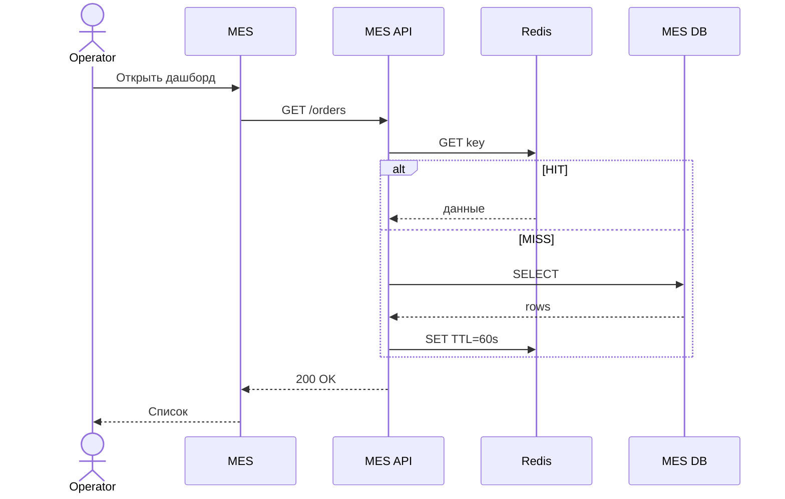
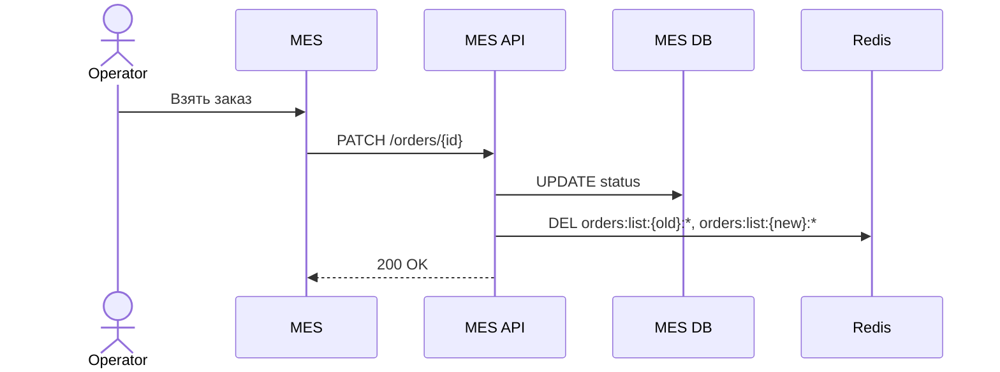

# Архитектурное решение по кешированию

## Что кешировать

| Данные | Где | Зачем |
|--------|-----|-------|
| Список заказов + счётчики по статусу | MES API → Redis | Медленный дашборд операторов (P0) |
| Цена по hash 3D-модели | MES API → Redis | Повторный расчёт за ms вместо 2–30 мин (P1) |

Не кешируем: данные «в процессе» расчёта, PII, запись статусов.

## Мотивация

Дашборд MES тормозит — каждый refresh оператора = тяжёлый SELECT. 10+ операторов + B2B API = MES DB перегружена.

**Эффект:** p95 дашборда < 500 ms, операторы быстрее забирают заказы, нагрузка на БД ↓.

## Предлагаемое решение

**Серверный Redis (Cache-Aside)** + SWR на фронте как бонус. Клиентский кеш alone не поможет — у каждого оператора свой, БД всё равно получает N запросов.

**Паттерн Cache-Aside** — чтений много, записей мало:
- Read: Redis → miss → DB → положить в Redis
- Write: DB → удалить ключи в Redis

| Паттерн | Почему нет |
|---------|-----------|
| Write-Through | Лишняя latency на каждую смену статуса |
| Refresh-Ahead | Непредсказуемо, что откроет оператор |

**Ключи:** `orders:list:{status}:{page}`, `orders:count:{status}` (TTL 60s), `price:hash:{model_hash}` (TTL 24h).

### Чтение списка заказов

### Смена статуса

## Инвалидация

**Программная по ключу** при смене статуса + TTL 60s как страховка.

| Стратегия | Вердикт |
|-----------|---------|
| Программная + TTL | ✓ Свежие данные сразу, простой DEL |
| Только TTL | ✗ До 60s stale — оператор не видит новый заказ |
| Write-Through sync | ✗ Сложнее, без выигрыша |

## Два варианта (доп.)

| | Redis Cache-Aside | Read Replica |
|--|-------------------|--------------|
| Плюсы | p95 < 500 ms, кеш цен | Без нового сервиса |
| Минусы | Нужен Redis | Тяжёлый SELECT остаётся, lag replica |

**Вывод:** Redis — основа. Read replica + индексы — дополнение (Task1), не замена.

## План

| Этап | Что | Срок |
|------|-----|------|
| 1 | Redis + Cache-Aside на GET /orders | 1–2 нед. |
| 2 | Инвалидация при PATCH, метрики hit/miss | 1 нед. |
| 3 | Кеш цен по hash модели | 1 нед. |

**Успех:** p95 < 500 ms, hit rate > 70%.
